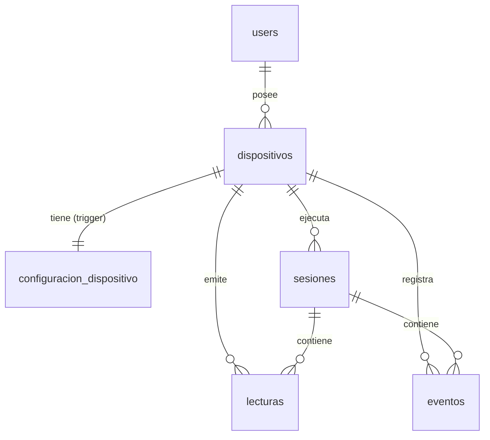

# Diagrama UML de la base de datos

Fuente de verdad: `apps/api/db/schema.sql`. Si el esquema cambia, este diagrama se actualiza a mano.

## Diagrama de clases (entidades y atributos)

```mermaid
classDiagram
  direction LR

  class users {
    +SERIAL id «PK»
    TEXT email «UK»
    TEXT password  // hash bcrypt
    TEXT name
    TEXT role  // admin | client
    BOOLEAN is_active
    TIMESTAMPTZ created_at
  }

  class dispositivos {
    +TEXT id «PK»  // = usuario MQTT
    INTEGER user_id «FK users»
    TEXT nombre
    TEXT ubicacion
    TEXT token_hash  // hash bcrypt del token MQTT
    BOOLEAN is_revoked
    BOOLEAN en_linea
    TIMESTAMPTZ ultimo_contacto
    TEXT version_firmware
    TIMESTAMPTZ creado_en
  }

  class configuracion_dispositivo {
    +TEXT dispositivo_id «PK, FK dispositivos»
    TEXT modo  // automatico | pausado | detenido
    INTEGER distancia_evasion_cm  // 5..50
    INTEGER distancia_precaucion_cm  // <= 100
    INTEGER velocidad_base_pct  // 30..100
    INTEGER intervalo_telemetria_ms  // 100..2000
    JSONB angulos_sensores  // {izq,centro,der}
    INTEGER area_ancho_cm
    INTEGER area_alto_cm
    TIMESTAMPTZ actualizado_en
  }

  class sesiones {
    +BIGSERIAL id «PK»
    TEXT dispositivo_id «FK dispositivos»
    TIMESTAMPTZ iniciada_en
    TIMESTAMPTZ finalizada_en  // null = activa
    INTEGER total_lecturas
    INTEGER total_evasiones
    NUMERIC distancia_recorrida_cm
    SMALLINT bateria_inicio_pct
    SMALLINT bateria_fin_pct
  }

  class lecturas {
    +BIGSERIAL id «PK»
    TEXT dispositivo_id «FK dispositivos»
    BIGINT sesion_id «FK sesiones»
    INTEGER secuencia  // UK (sesion_id, secuencia)
    NUMERIC dist_izq_cm
    NUMERIC dist_centro_cm
    NUMERIC dist_der_cm
    TEXT estado_movimiento
    NUMERIC pos_x_cm
    NUMERIC pos_y_cm
    NUMERIC orientacion_deg
    SMALLINT vel_izq_pct  // -100..100
    SMALLINT vel_der_pct  // -100..100
    NUMERIC bateria_v
    SMALLINT bateria_pct
    SMALLINT rssi_dbm
    TIMESTAMPTZ medido_en  // reloj NTP del ESP32
    TIMESTAMPTZ recibido_en
    TIMESTAMPTZ creado_en
  }

  class eventos {
    +BIGSERIAL id «PK»
    TEXT dispositivo_id «FK dispositivos»
    BIGINT sesion_id «FK sesiones»
    TEXT tipo  // obstaculo | atascado | bateria_baja | conexion | desconexion | cambio_modo
    TEXT sensor  // izq | centro | der
    NUMERIC distancia_cm
    NUMERIC pos_x_cm
    NUMERIC pos_y_cm
    TEXT mensaje
    BOOLEAN atendido
    TIMESTAMPTZ creado_en
  }

  users "1" --> "0..*" dispositivos : posee
  dispositivos "1" --> "1" configuracion_dispositivo : configura
  dispositivos "1" --> "0..*" sesiones : ejecuta
  dispositivos "1" --> "0..*" lecturas : emite
  dispositivos "1" --> "0..*" eventos : registra
  sesiones "1" --> "0..*" lecturas : agrupa
  sesiones "1" --> "0..*" eventos : agrupa
```

Todas las claves ajenas van con `ON DELETE CASCADE`: borrar un usuario borra sus robots, y
con ellos su configuración, sesiones, lecturas y eventos.

## Diagrama entidad-relación (cardinalidades)



## Vistas y función (derivadas, no almacenan datos)

```mermaid
classDiagram
  direction TB

  class v_lecturas_por_minuto {
    <<view>>
    GROUP BY dispositivo_id, sesion_id, minuto
    conteos por estado, min/prom distancias
    prom_bateria_pct, latencia_ms
  }
  class v_lecturas_por_hora {
    <<view>>
    GROUP BY dispositivo_id, hora
    + cerca_izq / cerca_centro / cerca_der (<= 15 cm)
  }
  class v_resumen_sesion {
    <<view>>
    duracion_s, pct_perdidas, latencia_ms
    bateria_consumida_pct, evasiones por sensor
  }
  class obtener_mapa_sesion {
    <<function>>
    (p_sesion_id, p_max_puntos = 3000)
    trayectoria muestreada + obstaculos JSONB
  }

  v_lecturas_por_minuto ..> lecturas : lee
  v_lecturas_por_hora ..> lecturas : lee
  v_resumen_sesion ..> sesiones : lee
  v_resumen_sesion ..> lecturas : lee
  v_resumen_sesion ..> eventos : lee
  obtener_mapa_sesion ..> lecturas : lee
  obtener_mapa_sesion ..> configuracion_dispositivo : lee angulos_sensores
```
