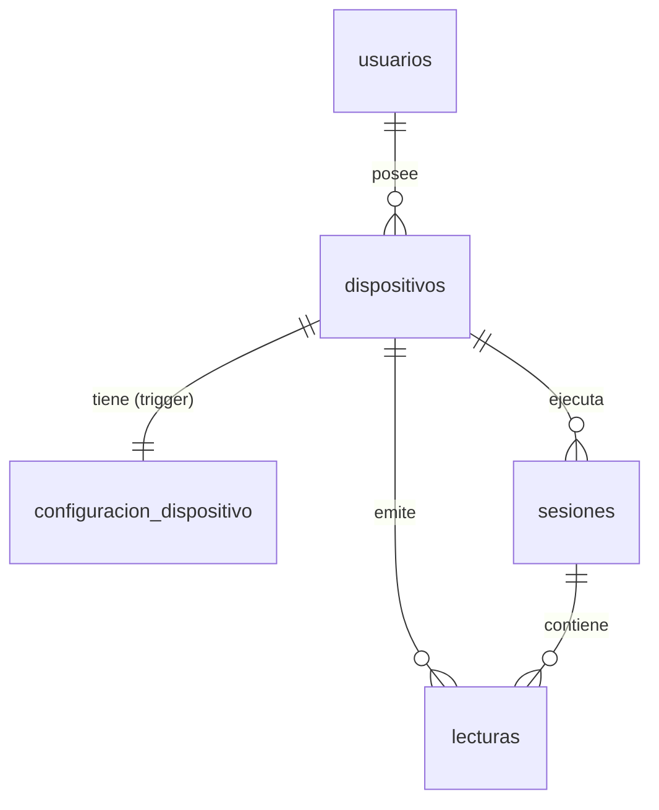
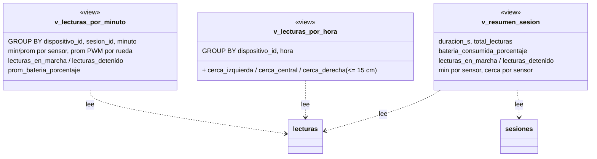
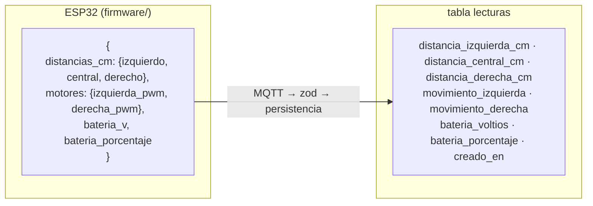

# Diagrama UML de la base de datos

Fuente de verdad: `apps/api/db/schema.sql`. Si el esquema cambia, este diagrama se actualiza a mano.
La explicación campo por campo está en [bd.md](./bd.md).

## Diagrama de clases (entidades y atributos)

```mermaid
classDiagram
  direction LR

  class usuarios {
    +SERIAL id «PK»
    TEXT correo «UK»
    TEXT contrasena  // hash bcrypt
    TEXT nombre
    TEXT rol  // admin | cliente
    BOOLEAN activo
    TIMESTAMPTZ creado_en
  }

  class dispositivos {
    +TEXT id «PK»  // = usuario MQTT = ROBOT_ID del firmware
    INTEGER usuario_id «FK usuarios»
    TEXT nombre
    TEXT ubicacion
    TEXT token_hash  // hash bcrypt del token MQTT
    BOOLEAN revocado
    BOOLEAN en_linea
    TIMESTAMPTZ ultimo_contacto
    TEXT version_firmware
    TIMESTAMPTZ creado_en
  }

  class configuracion_dispositivo {
    +TEXT dispositivo_id «PK, FK dispositivos»
    SMALLINT velocidad_base  // PWM 0..255
    JSONB angulos_sensores  // {izquierdo,central,derecho}
    TIMESTAMPTZ actualizado_en
  }

  class sesiones {
    +BIGSERIAL id «PK»
    TEXT dispositivo_id «FK dispositivos»
    TIMESTAMPTZ iniciada_en
    TIMESTAMPTZ finalizada_en  // null = activa
    INTEGER total_lecturas
    SMALLINT bateria_inicio_porcentaje
    SMALLINT bateria_fin_porcentaje
  }

  class lecturas {
    +BIGSERIAL id «PK»
    TEXT dispositivo_id «FK dispositivos»
    BIGINT sesion_id «FK sesiones»
    NUMERIC distancia_izquierda_cm  // null = nada en rango
    NUMERIC distancia_central_cm
    NUMERIC distancia_derecha_cm
    SMALLINT movimiento_izquierda  // -255..255
    SMALLINT movimiento_derecha  // -255..255
    NUMERIC bateria_voltios
    SMALLINT bateria_porcentaje  // 0..100
    TIMESTAMPTZ creado_en
  }

  usuarios "1" --> "0..*" dispositivos : posee
  dispositivos "1" --> "1" configuracion_dispositivo : configura
  dispositivos "1" --> "0..*" sesiones : ejecuta
  dispositivos "1" --> "0..*" lecturas : emite
  sesiones "1" --> "0..*" lecturas : agrupa
```

Todas las claves ajenas van con `ON DELETE CASCADE`: borrar un usuario borra sus robots, y
con ellos su configuración, sus sesiones y sus lecturas.

## Diagrama entidad-relación (cardinalidades)



## Vistas (derivadas, no almacenan datos)



## De dónde sale cada columna de `lecturas`

El JSON que publica `firmware/main.py` en `roomba/{id}/telemetria` se guarda sin traducir:


